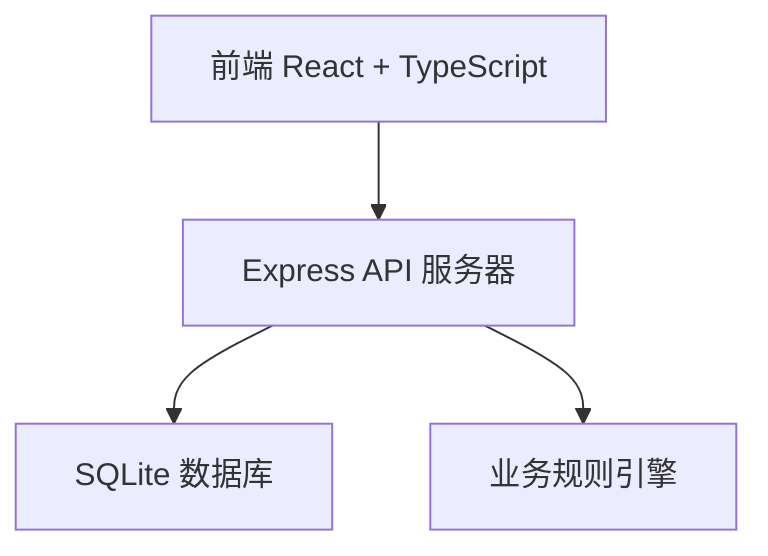
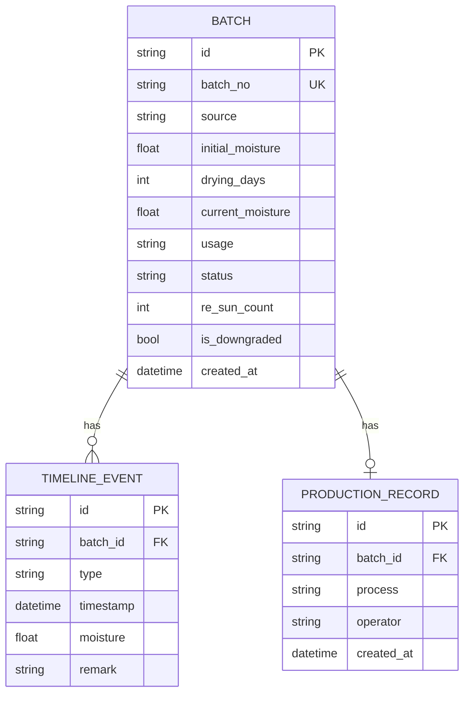

## 1. 架构设计



## 2. 技术描述

- 前端：React@18 + TypeScript + Vite + React Router@6 + TailwindCSS@3 + Zustand
- 后端：Express@4 + TypeScript
- 数据库：SQLite（文件数据库，轻量无服务，适合单机部署
- 容器：Docker Compose
- 前端HTTP客户端：fetch API
- 图标库：lucide-react

## 3. 路由定义

| 路由 | 用途 |
|-------|------|
| / | 批次列表首页 |
| /batches/:id | 批次追溯页 |
| /production | 投产登记页 |

## 4. API 定义

### 类型定义

```typescript
type BambooSource = '毛竹' | '慈竹'
type Usage = '细编' | '粗编'
type BatchStatus = '入棚中' | '晾晒中' | '可投产' | '已投产' | '已降级'

interface Batch {
  id: string
  batchNo: string
  source: BambooSource
  initialMoisture: number
  dryingDays: number
  currentMoisture: number
  usage: Usage
  status: BatchStatus
  reSunCount: number
  isDowngraded: boolean
  createdAt: string
}

interface TimelineEvent {
  id: string
  batchId: string
  type: '入棚' | '出棚检测' | '返晒' | '降级' | '投产'
  timestamp: string
  moisture?: number
  remark?: string
}

interface ProductionRecord {
  id: string
  batchId: string
  process: Usage
  operator: string
  createdAt: string
}
```

### 接口列表

| 方法 | 路径 | 说明 |
|------|------|------|
| GET | /api/batches | 获取所有批次 |
| GET | /api/batches/:id | 获取批次详情及时间线 |
| POST | /api/batches | 新增批次登记 |
| POST | /api/batches/:id/test | 出棚含水率检测 |
| POST | /api/productions | 投产登记（含用途校验） |
| GET | /api/productions | 获取投产记录 |

## 5. 服务端架构图

```mermaid
graph LR
    A["Router (routes) --> B["Controller"] --> C["Service (规则引擎"] --> D["Repository"] --> E["SQLite"]
```

## 6. 数据模型

### 6.1 ER 图



### 6.2 DDL

```sql
CREATE TABLE batches (
  id TEXT PRIMARY KEY,
  batch_no TEXT UNIQUE NOT NULL,
  source TEXT NOT NULL CHECK(source IN ('毛竹', '慈竹')),
  initial_moisture REAL NOT NULL,
  drying_days INTEGER NOT NULL,
  current_moisture REAL NOT NULL,
  usage TEXT NOT NULL CHECK(usage IN ('细编', '粗编')),
  status TEXT NOT NULL CHECK(status IN ('入棚中', '晾晒中', '可投产', '已投产', '已降级')),
  re_sun_count INTEGER DEFAULT 0,
  is_downgraded INTEGER DEFAULT 0,
  created_at TEXT NOT NULL
);

CREATE TABLE timeline_events (
  id TEXT PRIMARY KEY,
  batch_id TEXT NOT NULL,
  type TEXT NOT NULL,
  timestamp TEXT NOT NULL,
  moisture REAL,
  remark TEXT,
  FOREIGN KEY (batch_id) REFERENCES batches(id)
);

CREATE TABLE production_records (
  id TEXT PRIMARY KEY,
  batch_id TEXT NOT NULL,
  process TEXT NOT NULL,
  operator TEXT NOT NULL,
  created_at TEXT NOT NULL,
  FOREIGN KEY (batch_id) REFERENCES batches(id)
);
```
