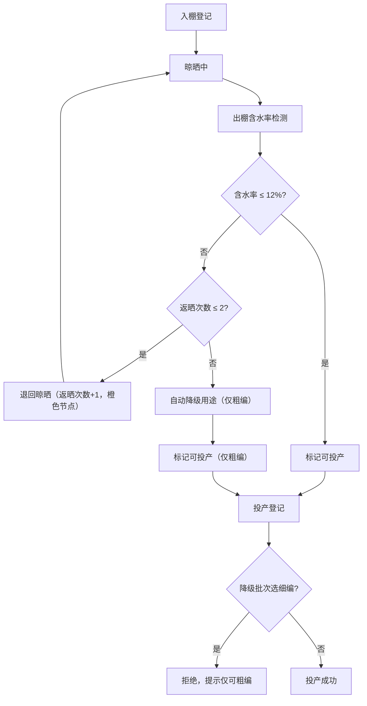

## 1. 产品概述

竹编工坊篾条含水率晾晒批次追溯系统，服务于竹编工坊生产管理场景，解决篾条晾晒过程中含水率的批次级追踪与投产质量管控。

- 核心目标：实现篾条从入棚晾晒到投产编织的全流程可追溯，确保含水率达标后投产，并对不合格批次进行返晒与降级处理。

## 2. 核心功能

### 2.1 用户角色

| 角色 | 注册方式 | 核心权限 |
|------|-----------|----------|
| 工坊管理员 | 系统内置 | 批次登记、晾晒管理、投产登记、批次追溯查询 |

### 2.2 功能模块

1. **批次列表页**：批次卡片展示、状态筛选、快速操作入口
2. **批次登记**：新增篾条入棚信息登记
3. **晾晒管理**：出棚含水率检测、返晒操作、状态流转
4. **投产登记**：绑定批次进行投产登记，含用途校验
5. **批次追溯页**：批次完整时间线可视化

### 2.3 页面详情

| 页面名称 | 模块名称 | 功能描述 |
|---------|---------|---------|
| 批次列表页 | 批次卡片列表 | 展示所有批次，按状态（入棚中/晾晒中/可投产/已投产/已降级）筛选，显示批次号、来源、当前含水率、用途、状态标签 |
| 批次列表页 | 操作栏 | 新增批次按钮、搜索框、状态筛选器 |
| 批次登记页/弹窗 | 入棚登记表单 | 录入批次号、篾条来源（毛竹/慈竹）、入棚含水率（%）、计划晾晒天数、用途（细编/粗编） |
| 晾晒管理页/弹窗 | 出棚检测 | 录入出棚含水率，系统自动判断（>12% 退回晾晒并记录返晒次数，返晒>2次自动降级） |
| 晾晒管理页/弹窗 | 返晒操作 | 记录返晒次数，显示当前返晒次数 |
| 投产登记页 | 投产表单 | 选择批次、选择工序（细编/粗编），降级批次仅允许粗编 |
| 批次追溯页 | 时间线展示 | 入棚→返晒（橙色节点）→出棚→投产的完整时间线，每节点显示时间、操作人、含水率数据 |

## 3. 核心流程

用户流程：登记篾条入棚 → 晾晒 → 出棚含水率检测 → 合格/不合格 → 合格则可投产 → 投产登记绑定批次
不合格则返晒（记录次数）→ 返晒≤2次可继续检测 → 返晒>2次自动降级用途（仅粗编）

## 4. 用户界面设计

### 4.1 设计风格

- 主色：竹青绿色系（自然、自然竹材主题），辅以暖橙（返晒节点警示）
- 次色：米白底色（竹编材质感）
- 按钮风格：圆润边角，微妙阴影，hover 时轻微上浮
- 字体：思源宋体（标题，传统工艺感）+ 系统无衬线（正文）
- 布局风格：卡片式布局，顶部导航栏 + 侧边筛选
- 图标风格：线性图标，竹编纹理装饰元素

### 4.2 页面设计概览

| 页面名称 | 模块名称 | UI 元素 |
|---------|---------|----------|
| 批次列表页 | 批次卡片 | 竹绿色状态标签、含水率进度条、竹编纹理卡片边框、操作按钮组 |
| 批次追溯页 | 时间线 | 垂直时间线、橙色返晒节点高亮、节点详情卡片 |
| 投产登记 | 表单 | 竹绿色提交按钮、状态实时校验提示 |

### 4.3 响应式

桌面端优先，移动端自适应（卡片堆叠、时间线压缩）
